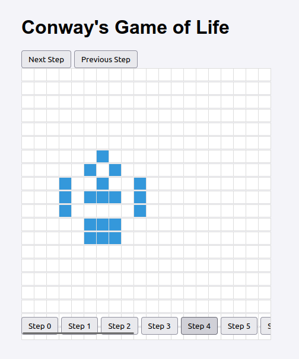

# reverse-life
AI-generated version of Conway's Game of Life, with backward step estimation.

## Sofware used:

| Software Type | Software | Notes |
| ------------- | -------- | ----- |
| Launcher | [Pinokio](https://pinokio.computer/) | v2.15.1 |
| AI Developer Agent | [Bolt](https://github.com/coleam00/bolt.new-any-llm) | commit  57c02362586f25fe0e999bd8a610eff2b098c682 |
| LLM API | [Ollama](https://ollama.com/) | v0.4.0 |
| LLM | qwen2.5-coder:32b | Installed using the front-end |

## Chat
 ---

> **Using: qwen2.5-coder:32b (Ollama)**: write a version of Conway's "Game of Life" that can go forwards and backwards in simulation time. For going backwards, just figure out a way to create a game state that will lead to the next step, even if it wasn't the real previous step.
 ---
> **Qwen**: Sure! Implementing Conway's Game of Life with the ability to move both forward and backward in time is an interesting challenge. To achieve this, we'll need to keep track of past states so we can revert back to them when needed. For moving forward, we'll calculate the next state based on the current rules. For moving backward, we'll generate a possible previous state that would lead to the current state.
> 
> Here's how I plan to implement it:
> 
>  * Set up Vite + React for the project.
>  * Create components for the game grid and controls.
>  * Implement the logic for forward and backward simulation > steps.
>  * Store past states to allow reverting back.
> 
> Let's start now.
> 
>  * Create package.json
>  * Run command: `npm install --save-dev vite`
>  * Create index.html
>  * Create src/main.jsx
>  * Create src/App.jsx
>  * Create src/index.css
>  * Start Application: `npm run dev`
 ---
> **Using: qwen2.5-coder:32b (Ollama)**: the buttons for the steps currently grow horizontally. Put them inside a frame so they don't affect the layout
 ---
> **Qwen**: To ensure that the step buttons do not affect the layout and remain contained within a frame, we can wrap them in a div with specific styling to keep them organized and prevent horizontal overflow.
>
> Here's the updated CSS and HTML structure:

>  *  Add a new class for the history container.
>  *  Update the App.jsx file to include this new class.
>
> Let's update the files accordingly.

>  *  Create package.json
>  *  Run command: `npm install --save-dev vite`
>  *  Create index.html
>  *  Create src/main.jsx
>  *  Create src/App.jsx
>  *  Create src/index.css
>  *  Start Application: `npm run dev`
 ---
## Screenshot
